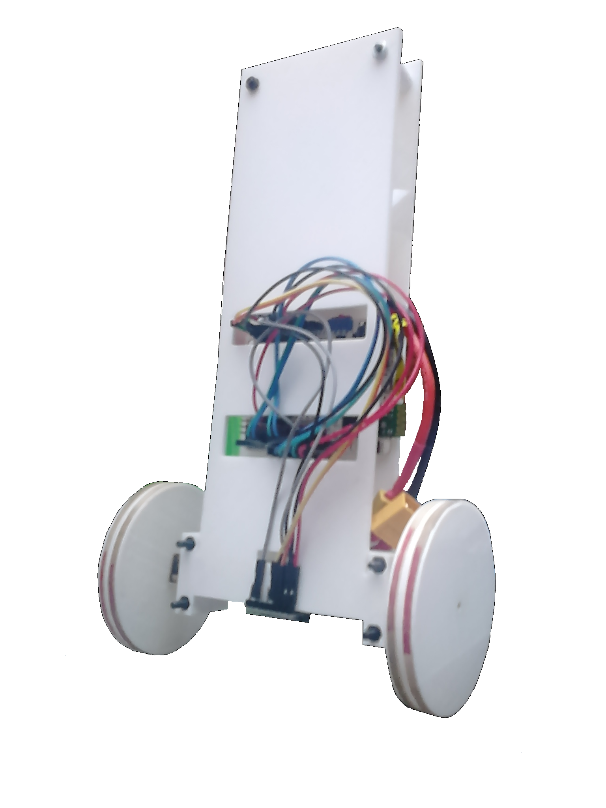

# InvertedPendulumBot

This project aims to be a platform to apply control and signal processing theory. Therefore basic and common algorithms has been used  such as PID and Complementary Filter and the following libraries helps the code to be clear and intelligible. 

# License

InvertedPendulumBot is licensed under a [Creative Commons Attribution-ShareAlike 4.0 International License] (https://creativecommons.org/licenses/by-sa/4.0/)

Please read the [LICENSE] (../master/LICENSE.md) file for more details.

# Work in progress
